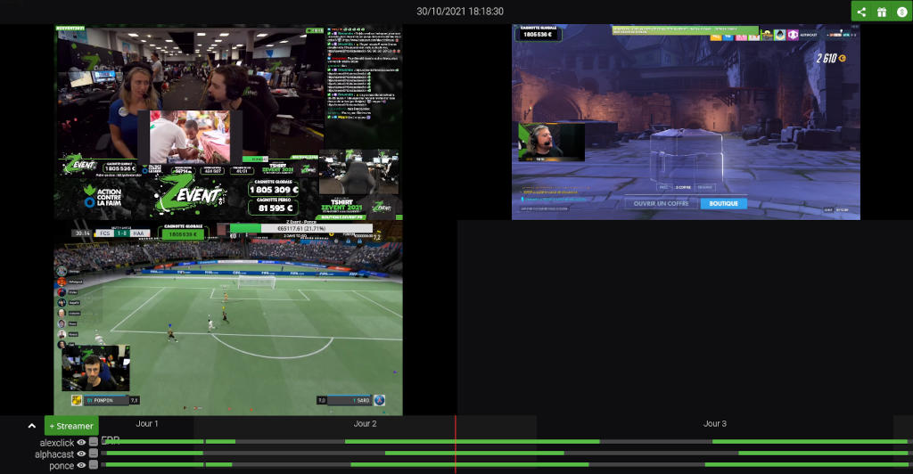

# replay-sync

<div align=center">

</div>

Promis je vais écrire un README. Un jour 😅

# HOW TO SETUP
Flemme d'écrire ça propre je le fais en mode YOLO

Déjà, clone zomboid-sync, c'est sans doute le + à jour.
Je te préviens c'est la merde j'ai essayé de migrer à Vite et ca fait chier mais revenir en arrière sera pire. Courage
```bash
mkdir ../webapp/zomboid-sync
cp -R ../webapp/rpz-sync/* ../webapp/zomboid-sync/
rm -rf ../webapp/zomboid-sync/.git
```

```bash
cd ../webapp/zomboid-sync
```

```bash
rm -rf node_modules
rm package-lock.json
npm i
cd node_modules/replay-sync
npm i
npm link replay-sync
```

Si npm link marche pas, faut sans doute changer de version de Node : 
```bash
cd /home/olivier/twitch-rpz-sync/replay-sync
nvm use 22
npm link
```

```bash
git init
```

Ok là t'as un dossier setup mais pas les bonnes VOD, faut lancer le script qui les extrait.
Faut d'abord modifier le fichier `src/streamers.js` et y mettre les bon streamers.
Faut aussi aller changer les timeframes dans `/src/config.js`
Clean aussi le fichier `allmeta-v2.json`, sinon ca va garder les VOD des autres.

Lance le script `dl-vod.js` via l'IDE, il faut des variables d'environnement:
- TWITCH_CLIENT_ID
- TWITCH_AUTH_TOKEN

## Normalement à ce stade, tu devrais pouvoir lancer l'app

```bash
npm start
```
